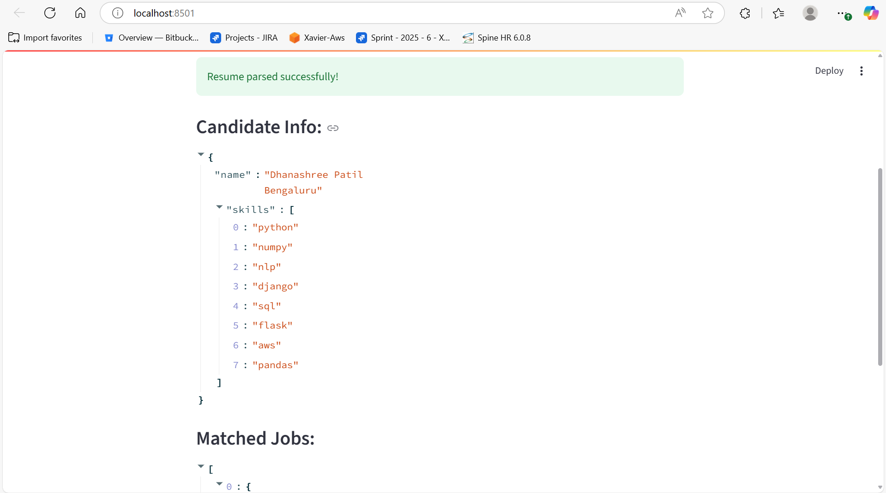
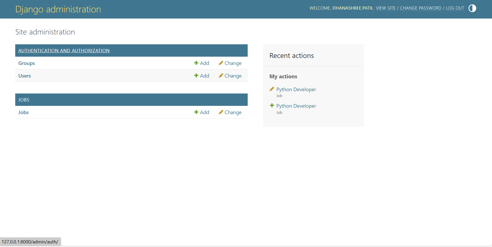

# 🧠 AI Resume Matcher (Flask + Django + Streamlit)

An end-to-end AI-powered Resume Parser & Job Matcher platform using:
- **Flask** microservice for parsing resumes using NLP (spaCy + PyMuPDF)
- **Django** backend for job listing microservice (REST API)
- **Streamlit** UI for candidate-friendly resume uploads and job recommendations

---

## 🚀 Features

- 📄 Upload your resume in PDF format
- 🤖 Extract structured skills using NLP (spaCy)
- 🔍 Matches your profile to job listings from Django
- 📊 Streamlit dashboard to display matched job roles
- 🔌 Microservice-based API Gateway using Flask for orchestration

---

## 🧱 Tech Stack

| Layer        | Tech Used                       |
|--------------|----------------------------------|
| UI           | Streamlit                       |
| AI/NLP       | spaCy, PyMuPDF                   |
| API Gateway  | Flask                            |
| Backend      | Django, Django REST Framework    |
| Deployment   | Localhost / Render-ready         |

---

## 🗂️ Folder Structure

resume-matcher-project/
├── flask_api/ # Resume parsing + job matching API (Flask)
├── django_admin_project/ # Job microservice (Django REST)
├── streamlit_ui.py # Streamlit frontend


---

## 🛠️ Setup Instructions

### 🔹 Step 1: Clone Repo

```bash
git clone https://github.com/your-username/resume-matcher-project.git
cd resume-matcher-project

🔹 Step 2: Set Up Virtual Environment
python -m venv venv
venv\Scripts\activate  # on Windows

🔹 Step 3: Install All Requirements
pip install -r requirements.txt

🔹 Step 4: Run Django API
cd django_admin_project
python manage.py migrate
python manage.py runserver

🔹 Step 5: Run Flask Parser API
cd flask_api
python app.py

🔹 Step 6: Run Streamlit Frontend
python -m streamlit run streamlit_ui.py

📷 Screenshots
### 🔹 Resume Upload in Streamlit


---

### 🔹 Matched Jobs Output



---

### 🔹 Django Admin: Job Listings



💡 Future Improvements
🧠 Add skill extraction using BERT / OpenAI Embeddings
🔐 Auth with JWT across Flask & Django
☁️ Deployment on Render / Railway
📤 CSV Upload for bulk job ingestion

📄 License
MIT License

👩‍💻 Author
Made with ❤️ by Dhanashree Patil
LinkedIn | GitHub

